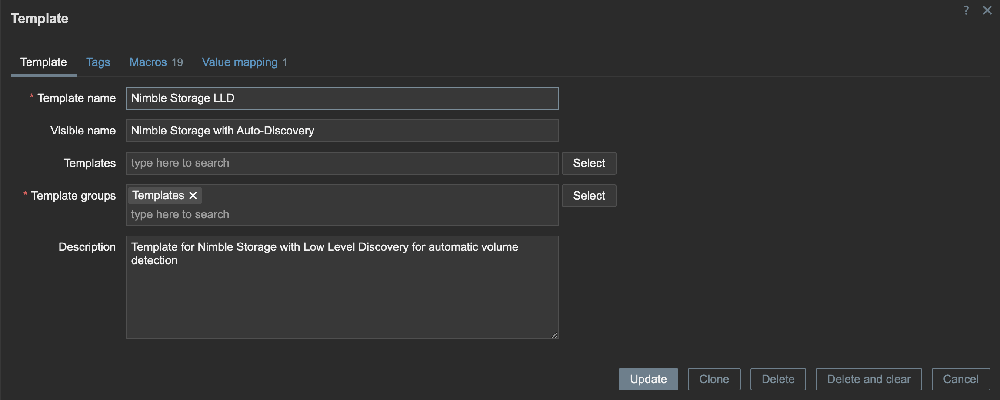

# Nimble Storage Zabbix Template Documentation

## Table of Contents
1. [Quick Start (TL;DR)](#quick-start-tldr)
2. [Key Monitoring Items](#key-monitoring-items)
3. [Prerequisites](#prerequisites)
4. [Implementation Steps](#implementation-steps)
5. [Template Configuration](#template-configuration)
6. [Nimble Storage Compatibility](#nimble-storage-compatibility)
7. [Zabbix Version Compatibility](#zabbix-version-compatibility)
8. [Template Limitations](#template-limitations)
9. [Performance Tuning](#performance-tuning)
10. [Integration Considerations](#integration-considerations)
11. [Troubleshooting](#troubleshooting)
12. [Version History](#version-history)

---

## Quick Start (TL;DR)
For experienced users:
1. Import template in Zabbix Web Interface
2. Enable SNMP on Nimble: `snmp --enable --port 161`
3. Create SNMP community: `snmp-community --create --name "public" --access-type read-only`
4. Add host with SNMP interface in Zabbix
5. Link template and wait for volume discovery (1 hour default)

---

## Key Monitoring Items

**Volume Information:** Names, sizes, usage, online status  
**I/O Metrics:** Read/write operations, bytes, latency histograms  
**Storage Utilization:** Disk space usage for volumes and snapshots  
**Connection Status:** Number of iSCSI connections per volume

---

## Prerequisites

### Prerequisites Checklist
- [ ] Zabbix 6.0+ server running
- [ ] Network connectivity to Nimble storage (port 161/UDP)
- [ ] SNMP MIB files available
- [ ] Administrative access to Nimble storage
- [ ] Read-only SNMP community configured

### MIB Files Setup

1. **Copy MIB files to Zabbix server**

2. **Move the MIB files to your SNMP MIB directory**
   ```bash
   sudo cp NIMBLE.mib NIMBLE-TRAPS.mib /usr/share/snmp/mibs/
   ```
   Or wherever your system stores MIB files

3. **Update SNMP configuration (if needed):**
   ```bash
   # Edit /etc/snmp/snmp.conf or ~/.snmp/snmp.conf
   mibs +ALL
   ```

---

## Implementation Steps

### 1. Import the Template
- In Zabbix Web Interface:
  - Go to **Configuration → Templates**
  - Click **Import**
  - Upload the `nimble_storage.yaml` file
- Review import options and click **Import**

### 2. Configure SNMP on Nimble Device
Ensure SNMP is enabled on your Nimble storage:

```bash
# Nimble CLI commands needed:
snmp-community --create --name "public" --access-type read-only
snmp --enable --port 161
```

**SNMP Configuration Options:**
- Enable SNMP v2c or v3
- Set community string (for v2c) or configure user credentials (for v3)
- Allow access from your Zabbix server IP

### 3. Create Host in Zabbix
**Add new host:**
- Go to **Configuration → Hosts**
- Click **Create host**
- Fill in:
  - **Host name:** Nimble-01 (or your naming convention)
  - **Groups:** Select appropriate group or create new one
  - **Interfaces:** Add SNMP interface with Nimble's IP or Domain address

**Configure SNMP Interface:**
- **IP address:** Your Nimble storage IP
- **Port:** 161 (default SNMP port)
- **SNMP version:** v2c or v3
- **Community:** Your SNMP community string (for v2c)

**Link Template:**
- In **Templates** tab, click **Select**
- Choose **Nimble Storage LLD** template
- Click **Add** then **Update**

### 4. Verify Discovery
- Wait for initial discovery cycle (1 hour by default)
- Check **Configuration → Hosts → [Your Host] → Discovery** for volume discovery results
- Verify items are being collected: **Monitoring → Latest data**

---

## Template Configuration

### Available Macros

You may customize these macros at the host level:

#### Storage Thresholds (Multi-level)
- `{$VOLUME.USAGE.WARN}` = **80%** (Warning level)
- `{$VOLUME.USAGE.HIGH}` = **90%** (High level)
- `{$VOLUME.USAGE.CRIT}` = **95%** (Critical level)

#### Performance Thresholds (Multi-level)
- `{$LATENCY.READ.WARN}` = **30ms** (Read warning)
- `{$LATENCY.READ.HIGH}` = **50ms** (Read high)
- `{$LATENCY.WRITE.WARN}` = **30ms** (Write warning)
- `{$LATENCY.WRITE.HIGH}` = **50ms** (Write high)
- `{$LATENCY.SAMPLE.PERIOD}` = **5m** (Sample period)

#### Configuration & Retention
- `{$DISCOVERY.INTERVAL}` = **1h** (Discovery frequency)
- `{$HISTORY.SHORT}` = **1h** (Short-term retention)
- `{$HISTORY.STANDARD}` = **7d** (Standard retention)
- `{$TRENDS.STANDARD}` = **90d** (Trends retention)
- `{$TRENDS.DISABLED}` = **0d** (No trends)

#### SNMP OID Base Paths
- `{$NIMBLE.OID.BASE}` = **.1.3.6.1.4.1.37447** (Base Nimble OID)
- `{$NIMBLE.OID.GLOBAL}` = **.1.3.6.1.4.1.37447.1.3** (Global statistics path)
- `{$NIMBLE.OID.VOLUME}` = **.1.3.6.1.4.1.37447.1.2.1** (Volume table path)

#### Unit Conversion Factors
- `{$NIMBLE.MB.TO.BYTES}` = **1048576** (MB to bytes)
- `{$NIMBLE.LATENCY.CONVERSION}` = **0.00001** (Latency factor)
- `{$NIMBLE.64BIT.HIGH.MULTIPLIER}` = **4294967296** (64-bit high)

---

## Nimble Storage Compatibility

### Supported Models
- **CS-Series** (All-Flash Arrays) - ✅ Supported
- **AF-Series** (All-Flash Arrays) - ✅ Supported  
- **HF-Series** (Hybrid Flash Arrays) - ✅ Supported
- **SF-Series** (Secondary Flash Arrays) - ✅ Supported

### Nimble OS Version Requirements
- **Minimum:** Nimble OS 2.3.x+ (when SNMP support was introduced)
- **Recommended:** Nimble OS 5.0+ for full OID support
- **Latest:** Nimble OS 6.x (HPE InfoSight era)

> **Note:** Tested on Nimble OS Version 6.0.0.500-1005932-opt  
> **Note:** HPE acquired Nimble Storage in 2017, so newer deployments are branded as HPE Nimble Storage.

### SNMP Configuration Requirements
```bash
# Nimble CLI commands needed:
snmp-community --create --name "public" --access-type read-only
snmp --enable --port 161
```

---

## Zabbix Version Compatibility

### Supported Versions
- **Template Format:** Zabbix 7.0 (as specified in export)
- **Minimum Compatible:** Zabbix 6.0+ (with minor syntax adjustments)
- **Not Compatible:** Zabbix 5.x and below (major syntax differences)

> **Note:** Tested on Zabbix 7.2.3

### Version-Specific Compatibility

**Zabbix 7.0+:** ✅ **Full compatibility**
- Native macro support
- Modern trigger expressions
- Enhanced LLD functionality

**Zabbix 6.4/6.2:** ⚠️ **Mostly compatible**
- May need minor trigger expression updates
- Some macro features limited

**Zabbix 6.0:** ⚠️ **Requires modifications**
- Older LLD syntax
- Different preprocessing options
- Limited macro inheritance

---

## Template Limitations

### Current Scope
**Volume-Level Monitoring Only**
- No array-level hardware monitoring (controllers, disks, fans)
- No network interface monitoring
- No shelf/enclosure monitoring

### Performance Metrics Limited To
- IOPS (Read/Write)
- Throughput (Bytes/sec)
- Latency (Average only, not percentiles)
- Basic capacity metrics

### Missing Advanced Features
- No snapshot monitoring beyond basic space usage
- No replication monitoring
- No thin provisioning details
- No dedupe/compression ratios
- No cache hit rates

### SNMP OID Limitations
These OIDs may not be available on all firmware versions:
- **.1.3.6.1.4.1.37447.1.2.1.34** (Write Operations) - Added in NOS 3.x
- **.1.3.6.1.4.1.37447.1.2.1.35** (Write Latency) - Added in NOS 3.x
- Some performance counters require NOS 4.x+

### Discovery Limitations
- Only discovers **online** volumes by default
- Offline/unmounted volumes may not appear (testing showed no issues)
- No automatic discovery of:
  - Snapshots
  - Replication partners
  - Performance policies
  - Initiator groups

### Network & Security Constraints
**SNMP Requirements:**
- **Protocol:** SNMPv2c (SNMPv3 supported but template uses v2c)
- **Port:** 161/UDP must be accessible
- **Community:** Read-only access sufficient
- **Firewall:** Zabbix server → Nimble array communication

**Performance Impact:**
- **Discovery Interval:** 1-hour default (configurable via macro)
- **Polling Frequency:** 1-minute default for most metrics
- **SNMP Load:** Minimal impact on array performance

---

## Performance Tuning

### Recommended Settings by Environment Size

#### Small Environment (1-5 volumes)
```yaml
{$DISCOVERY.INTERVAL}: "30m"
{$HISTORY.STANDARD}: "14d"
{$TRENDS.STANDARD}: "180d"
```

#### Medium Environment (6-25 volumes)
```yaml
{$DISCOVERY.INTERVAL}: "1h"
{$HISTORY.STANDARD}: "7d"
{$TRENDS.STANDARD}: "90d"
```

#### Large Environment (50+ volumes)
```yaml
{$DISCOVERY.INTERVAL}: "2h"
{$HISTORY.STANDARD}: "3d"
{$TRENDS.STANDARD}: "30d"
```
- Consider Zabbix proxy for remote sites
- Monitor database growth and adjust retention accordingly

### Custom Thresholds per Volume
For volume-specific requirements, create host-level macros:
```yaml
{$VOLUME.USAGE.WARN.volume1}: "85"
{$VOLUME.USAGE.HIGH.volume1}: "92"
{$LATENCY.READ.HIGH.volume1}: "25"
```

---

## Integration Considerations

### HPE InfoSight
- This template **complements** InfoSight analytics
- InfoSight provides deeper insights and predictive analytics
- Use Zabbix for real-time alerting, InfoSight for trend analysis

---

## Troubleshooting

### Common Issues

#### SNMP Not Responding
```bash
# Test SNMP connectivity from Zabbix server
snmpwalk -v2c -c public <nimble-ip> 1.3.6.1.4.1.37447.1.3.1.0

# Expected output should show system information
# If no response, check:
# 1. Firewall rules
# 2. SNMP configuration on Nimble
# 3. Community string mismatch
```

#### Volume Discovery Not Working
**Check volume status:**
```bash
# On Nimble CLI
vol --list

# Verify volumes are online
# Check if SNMP OIDs are accessible
```

**Troubleshooting steps:**
1. Increase discovery interval if needed
2. Check Zabbix server logs for SNMP errors
3. Verify OID accessibility manually
4. Ensure proper template linking

#### High Latency False Alerts
**Common causes:**
- Network latency between hosts and storage
- Backup operations affecting performance
- Initial array warmup period

**Solutions:**
```yaml
# Adjust warning thresholds for your environment
{$LATENCY.READ.WARN}: "50"    # Increase from 30ms
{$LATENCY.WRITE.WARN}: "50"   # Increase from 30ms
{$LATENCY.SAMPLE.PERIOD}: "10m" # Longer sample period
```

#### Template Import Errors
**Zabbix version compatibility issues:**
- Verify Zabbix version supports template format
- Check for syntax errors in trigger expressions
- Ensure all required macros are defined

#### Missing Volume Data
**Possible causes:**
1. Volume is offline or unmounted
2. SNMP OID not supported in current firmware
3. Insufficient SNMP permissions

**Diagnostic commands:**
```bash
# Check specific volume OID
snmpwalk -v2c -c public <nimble-ip> 1.3.6.1.4.1.37447.1.2.1.3

# List all available OIDs
snmpwalk -v2c -c public <nimble-ip> 1.3.6.1.4.1.37447
```

### Log Analysis
**Zabbix server logs:**
```bash
# Check for SNMP-related errors
tail -f /var/log/zabbix/zabbix_server.log | grep -i snmp

# Look for discovery issues
grep "discovery" /var/log/zabbix/zabbix_server.log
```

**Nimble logs:**
```bash
# Check SNMP access logs on Nimble
grep -i snmp /var/log/messages
```

---

## Version History

- **v1.0** - Initial release (Zabbix 7.0, Nimble OS 6.x)
  - Basic volume monitoring
  - I/O performance metrics
  - Simple threshold triggers

- **v1.1** - Enhanced monitoring (Current)
  - Added multi-level alerting macros
  - Improved trigger expressions
  - Comprehensive macro support
  - Better error handling

- **Future Roadmap**
  - Hardware monitoring (controllers, disks, fans)
  - SNMPv3 support
  - Snapshot and replication monitoring
  - Integration with HPE InfoSight APIs

---

## Support Information

### Tested Environment
- **Nimble OS:** 6.0.0.500-1005932-opt
- **Zabbix:** 7.2.3
- **SNMP:** v2c with read-only community
- **Models:** AF40, CS1000 (should work with all models)

### Community Support
- Template improvements and bug reports welcome as long as I have access to a nimble
- Share customizations and environment-specific modifications
- Consider contributing additional hardware monitoring OIDs

### Best Practices
1. **Start with default thresholds** and adjust based on your environment
2. **Monitor template performance impact** during initial deployment
3. **Document custom macro changes** for your environment
4. **Test template updates** in non-production first
5. **Coordinate with storage administrators** for SNMP access

---

## Screenshots
### Template



---

*Last updated: June 2025 - Template version 1.1*
